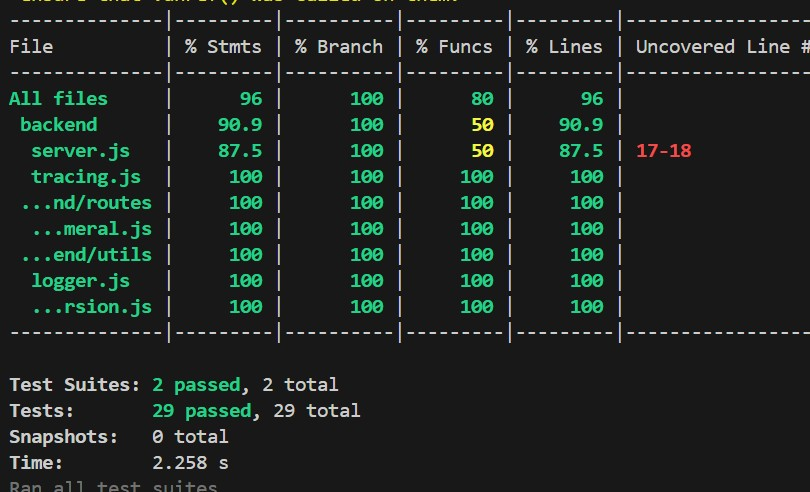
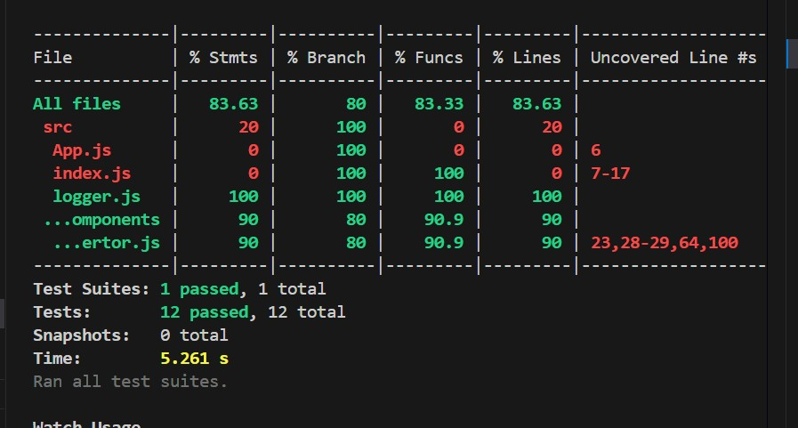
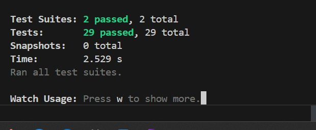
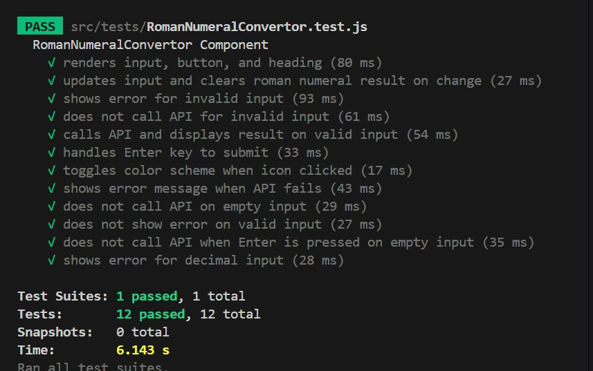
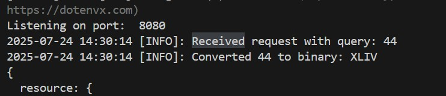
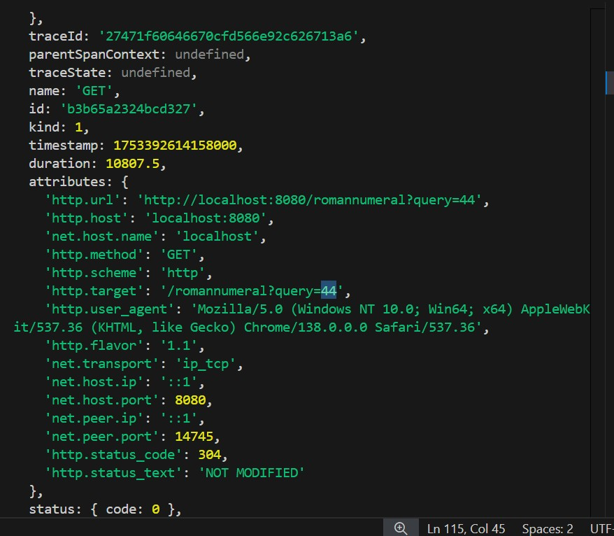
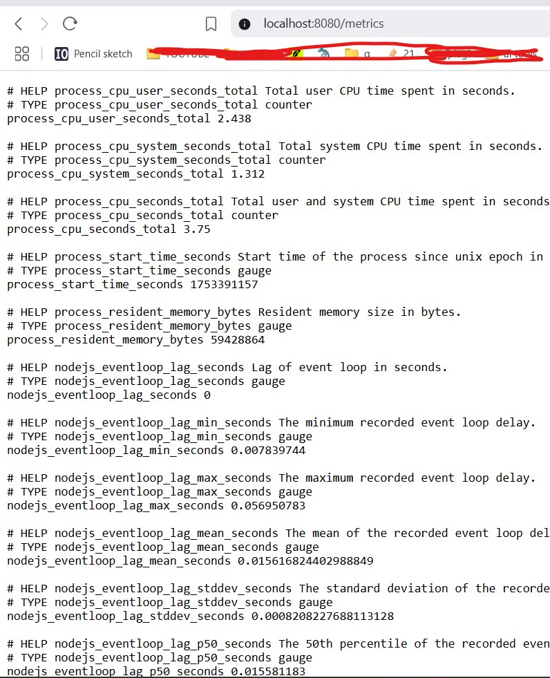
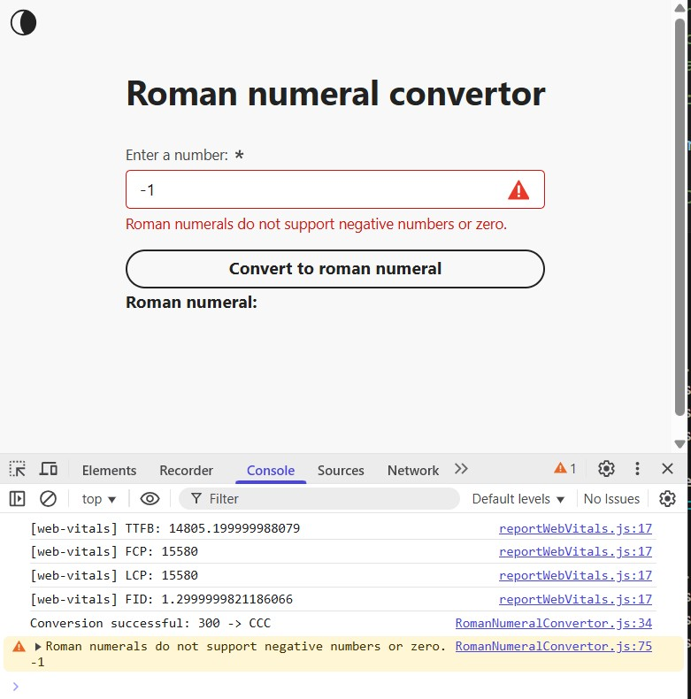

# Getting Started

The Roman Numeral app converts integer in range 1 - 3999 (inclusive) to Roman Numeral.

The code is written with create-react-app on front end and node.js and express on the backend.

App is live  [here](https://roman-numeral-frontend.vercel.app/)

Backend is live  [here](https://roman-number-backend.vercel.app/romannumeral?query=40)

## Getting Started

Clone both Frontend and Backend from the github page [here](https://github.com/Sandesh-bn/roman-numeral-frontend) and [here](https://github.com/Sandesh-bn/roman-number-backend)

Open terminal for each folders.

### For Backend:
Navigate to backend/
```bash
npm i
```
```bash
npm start
```

Backend will run on port: https://localhost:8080

To run tests

```bash
npm run test
```

### For Frontend:
Navigate to frontend/
```bash
npm i
```
```bash
npm start
```

Frontend will run on port: https://localhost:3000

To run tests

```bash
npm run test
```

### API endpoints:
      UI: http://localhost:3000

      Backend API: http://localhost:8080/romannumeral?query=120 

      Metrics: http://localhost:8080/metrics


### Test coverage:
```bash
npx jest --coverage
```






## Observability

### Backend

#### Logging
        Implemented using Winston. 

        Logs all API requests, errors, and successful conversions. 

        Logs are output to the server console

      
#### Tracing:
        Implemented using OpenTelemetry. 

        Traces all incoming API requests and middleware. 

        Trace data is output to the server console for local development

        
#### Metrics:
        Implemented using prom-client. 

        Exposes a /metrics endpoint at http://localhost:8080/metrics. 

        Metrics include CPU, memory, event loop lag, and more (Prometheus-compatible).

        
### Frontend
#### Logging
        Implemented using loglevel.

        Logs user actions, conversions, and errors. 

        Logs are visible in the browser console. 
#### Tracing 
        Implemented using OpenTelemetry JS. 

        Traces page loads and API (fetch) requests. ·

        Trace data is output to the browser console. 
        
#### Metrics ·
      Implemented using web-vitals. 

      Logs key performance metrics (FCP, LCP, CLS, TTFB) to the browser console

    